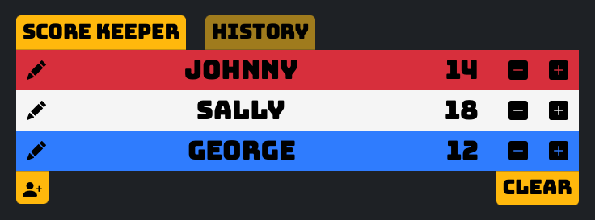

# Promineo Week-12: CRUD Application

## Score Keeper

This is a handy little tool for keeping score during board games. Results of every game can be saved for later reflection, celebration, and vainglorious boasting.

### Coding Assignment Instructions:

Create a full CRUD application of your choice using either an API or local Array.

- Use an existing API with AJAX to interact with it.
- If you do not use an API, store the entities you will create, read, update, and delete in an array.
- Use a form to post new entities.
- Build a way for users to update or delete entities
- Use Bootstrap and CSS to style your project.
